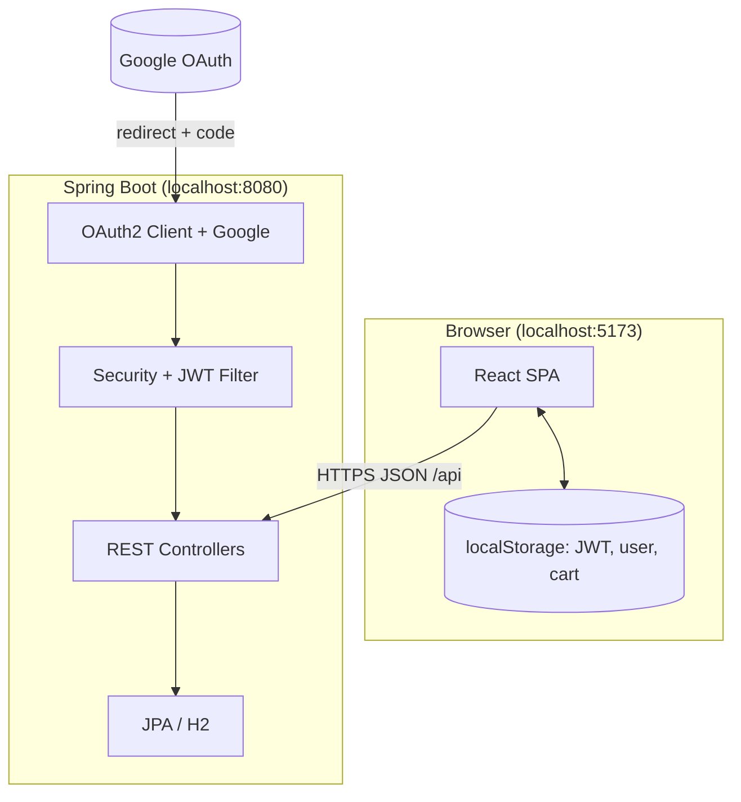

# BusyCommerce — Full-Stack E-Commerce (React + Spring Boot)

Professional demo application: **JWT authentication**, **Google single sign-on (SSO)**, **role-based access**, **product catalog**, **shopping cart**, **checkout thank-you flow**, and **profile management**. The UI uses **React (Vite)**; the API is **Spring Boot 3** with **H2** (in-memory) for local development.

---

## Table of contents

1. [Features](#features)
2. [What to install locally](#what-to-install-locally)
3. [Get the project on your machine](#get-the-project-on-your-machine)
4. [Project structure](#project-structure)
5. [Run the backend (step by step)](#run-the-backend-step-by-step)
6. [Run the frontend (step by step)](#run-the-frontend-step-by-step)
7. [Environment variables](#environment-variables)
8. [Google OAuth setup (SSO)](#google-oauth-setup-sso)
9. [Demo accounts & seeded data](#demo-accounts--seeded-data)
10. [API reference](#api-reference)
11. [Troubleshooting](#troubleshooting)
12. [Production notes](#production-notes)
13. [Push to GitHub](#push-to-github)

---

## Features

### Authentication & security

| Feature | Description |
|--------|-------------|
| **Email/username + password** | Register and login; API returns a **JWT** stored in the browser (`localStorage`). |
| **Strong password policy** | Passwords must be **8+ characters**, include **uppercase**, **lowercase**, **digit**, and **special** character from `@$!%*?&`, with **no whitespace**. |
| **Live password checklist** | On **Register** and **Change password**, rules appear as a list: **green** when satisfied, **black** when not. |
| **Google SSO (OAuth 2.0 / OpenID Connect)** | “Continue with Google” sends the user to Google, then back to the app with a JWT. |
| **Account picker** | Google is configured with `prompt=select_account` so users can choose which Google account to use. |
| **Role-based access (RBAC)** | `ROLE_ADMIN` vs `ROLE_USER`; enforced in Spring Security and in the UI. |

### Store & cart

| Feature | Description |
|--------|-------------|
| **Product dashboard** | List products; **admins** can add / edit / delete **their own** products; **users** browse and add to cart. |
| **Shopping cart** | Modal cart from the header; quantity controls, remove, clear. |
| **Buy flow** | **Buy** clears the cart and shows a **thank-you** modal with **BusyCommerce** branding and **Continue shopping** (returns to dashboard). |

### Profile & branding

| Feature | Description |
|--------|-------------|
| **Profile** | View/update **email**, **full name**, **phone**; **change password** with the same strong rules + checklist. |
| **BusyCommerce logo** | Header brand image (`BusyCommerceLogo`) instead of plain text. |
| **Login page** | Split layout with illustration; **demo credentials** panel; styled **Google** sign-in button. |

### Backend data

| Feature | Description |
|--------|-------------|
| **H2 in-memory database** | Fresh DB each JVM start (see `application.properties`). |
| **Demo users** | `admin`, `admin2`, `user` are **upserted on every startup** so passwords always match the documented values (fixes stale hashes after password rule changes). |
| **Seed products** | **Eight** sample products attributed to `admin` when the product table is empty. |

---

## What to install locally

Install these **before** running the app.

| Software | Version | Why |
|----------|---------|-----|
| **Java Development Kit (JDK)** | **17 or newer** (LTS recommended: 17 or 21) | Spring Boot 3 and the Maven wrapper compile/run the backend. |
| **Node.js** | **18 or newer** | Runs the Vite dev server and npm scripts for the frontend. |
| **npm** | Comes with Node | Installs frontend dependencies. |
| **Git** (optional) | Latest | Clone the repository. You can also download a ZIP from GitHub. |

**Windows:** PowerShell is used for `backend/run-with-env.ps1` (loads `.env` into the process before starting Spring Boot).

**macOS / Linux:** You do **not** need a global Maven install if you use `./mvnw` from the `backend` folder (Maven is bundled via the wrapper).

**Google SSO (optional):** A **Google Cloud** project with **OAuth 2.0 Client ID** (Web application). Not required for username/password login only.

---

## Get the project on your machine

### Option A — Git clone

```bash
git clone <your-repository-url>
cd ecommerce
```

### Option B — ZIP download

1. Download the repository as a ZIP from your Git host.  
2. Extract it.  
3. Open a terminal in the extracted folder (the folder that contains `backend` and `frontend`).

---

## Project structure

High-level layout (ignoring `node_modules`, `target`, build artifacts):

```text
ecommerce/
├── backend/                      # Spring Boot API
│   ├── mvnw, mvnw.cmd            # Maven Wrapper (no global Maven required)
│   ├── pom.xml
│   ├── run-with-env.ps1          # Windows: load .env then spring-boot:run
│   ├── .env.example              # Template for Google OAuth secrets
│   └── src/main/
│       ├── java/.../ecommerce/   # Java package: com.ecommerce.*
│       │   ├── EcommerceBackendApplication.java
│       │   ├── config/           # SecurityConfig, DataInitializer
│       │   ├── controller/       # Auth, Product, Profile REST controllers
│       │   ├── dto/              # Request/response records
│       │   ├── model/            # UserEntity, Product, Role
│       │   ├── repository/       # Spring Data JPA
│       │   ├── security/         # JWT filter, JwtService, OAuth2 success handler
│       │   └── service/          # UserDetailsService
│       └── resources/
│           └── application.properties
│
├── frontend/                     # React (Vite) SPA
│   ├── index.html
│   ├── package.json
│   ├── vite.config.* (if present)
│   └── src/
│       ├── main.jsx              # App entry + BrowserRouter
│       ├── App.jsx               # Routes, header, cart & checkout modals
│       ├── style.css             # Global styles
│       ├── api/client.js         # Axios instance → http://localhost:8080/api
│       ├── assets/               # Images (logo, login, google icon, etc.)
│       ├── state/
│       │   ├── AuthContext.jsx   # token, user, login/logout
│       │   └── CartContext.jsx   # cart persisted per username in localStorage
│       └── views/
│           ├── LoginPage.jsx
│           ├── RegisterPage.jsx
│           ├── OAuthSuccessPage.jsx  # Google callback: reads token from query
│           ├── DashboardPage.jsx
│           └── ProfilePage.jsx
│
└── README.md
```

### Architecture diagram



---

## Run the backend (step by step)

1. **Open a terminal** in the `backend` directory:

   ```bash
   cd backend
   ```

2. **(Recommended) Configure Google SSO via `.env`**

   - Copy the example file:

     ```bash
     # Windows PowerShell
     copy .env.example .env
     ```

     ```bash
     # macOS / Linux
     cp .env.example .env
     ```

   - Edit `backend/.env` and set:

     - `GOOGLE_CLIENT_ID`
     - `GOOGLE_CLIENT_SECRET`
     - `OAUTH2_REDIRECT_URI` — default `http://localhost:5173/oauth-success` (frontend callback page)

   > **Username/password only:** You can leave Google variables empty *only if* OAuth client is not configured; Spring may still expect valid OAuth properties depending on your build. For a smooth experience, either configure Google or ensure empty client id does not break startup (if you see errors, set real credentials or disable OAuth in code — this project expects Google keys for full SSO.)

3. **Start the API**

   **Windows (loads `.env` automatically):**

   ```powershell
   .\run-with-env.ps1
   ```

   **Any OS using Maven Wrapper (set env vars yourself first if using Google):**

   ```bash
   # macOS / Linux example
   export GOOGLE_CLIENT_ID="your-client-id"
   export GOOGLE_CLIENT_SECRET="your-client-secret"
   export OAUTH2_REDIRECT_URI="http://localhost:5173/oauth-success"
   ./mvnw spring-boot:run
   ```

   **Windows `cmd.exe` (after setting variables in System Properties or `set`):**

   ```cmd
   mvnw.cmd spring-boot:run
   ```

4. **Confirm** the log shows the app started and **Tomcat** on port **8080**:

   - Base URL: `http://localhost:8080`
   - API prefix: `http://localhost:8080/api/...`
   - H2 console (dev): `http://localhost:8080/h2-console` (see `application.properties`)

5. **First-time compile** (optional): `.\mvnw.cmd -DskipTests compile` (Windows) or `./mvnw -DskipTests compile` (Unix).

---

## Run the frontend (step by step)

1. **Open a second terminal** in the `frontend` directory:

   ```bash
   cd frontend
   ```

2. **Install dependencies** (once per clone, or after `package.json` changes):

   ```bash
   npm install
   ```

3. **Start the dev server:**

   ```bash
   npm run dev
   ```

4. Open the URL Vite prints (usually **`http://localhost:5173`**).

5. **Build for production** (optional):

   ```bash
   npm run build
   npm run preview   # local preview of production build
   ```

The Axios client is configured with **`baseURL: http://localhost:8080/api`**. Keep the backend running while you use the UI.

---

## Environment variables

| Variable | Used by | Purpose |
|----------|---------|---------|
| `GOOGLE_CLIENT_ID` | Backend | Google OAuth client ID |
| `GOOGLE_CLIENT_SECRET` | Backend | Google OAuth client secret |
| `OAUTH2_REDIRECT_URI` | Backend (`app.oauth2.redirect-uri`) | Where the API redirects after Google login (must match your frontend route, default `http://localhost:5173/oauth-success`) |

Store these in **`backend/.env`** (ignored by git) and use **`run-with-env.ps1`** on Windows, or export them in your shell on macOS/Linux.

**JWT signing:** Demo secret lives in `application.properties` (`app.jwt.secret`). **Replace with a secure secret in production** (Base64-encoded key suitable for HS256).

---

## Google OAuth setup (SSO)

1. Go to [Google Cloud Console](https://console.cloud.google.com/).
2. Create or select a project.
3. **APIs & Services → OAuth consent screen** — configure (External / Testing is fine for dev).
4. **Credentials → Create credentials → OAuth client ID → Web application**.
5. **Authorized redirect URIs** — add **exactly**:

   ```text
   http://localhost:8080/login/oauth2/code/google
   ```

   This is the Spring Security default callback URL for the `google` registration.

6. Copy **Client ID** and **Client secret** into `backend/.env`.
7. Restart the backend.

If Google shows **`redirect_uri_mismatch`**, the URI in the console does not match the one Spring uses (scheme, host, port, and path must match exactly).

---

## Demo accounts & seeded data

Passwords match the **same rules** as registration (8+ chars, upper, lower, digit, special from `@$!%*?&`).

| Role | Username | Email | Password |
|------|----------|-------|----------|
| Admin | `admin` | admin@gmail.com | `Admin@123` |
| Admin | `admin2` | admin2@gmail.com | `Admin2@demo` |
| User | `user` | user@gmail.com | `User@12345` |

On **every** backend startup, these three accounts are **upserted** (password hash refreshed) so they always work with the values above.

**Products:** If the catalog is empty, **eight** demo products are created and attributed to `admin`.

---

## API reference

All routes below are under **`http://localhost:8080/api`** unless noted.

| Method | Path | Auth | Description |
|--------|------|------|-------------|
| POST | `/auth/register` | Public | Register; returns JWT + username + role |
| POST | `/auth/login` | Public | Login; returns JWT + username + role |
| GET | `/products` | JWT (ADMIN or USER) | List products |
| POST | `/products` | JWT (ADMIN) | Create product |
| PUT | `/products/{id}` | JWT (ADMIN) | Update product |
| DELETE | `/products/{id}` | JWT (ADMIN) | Delete product |
| GET | `/profile` | JWT | Get profile |
| PUT | `/profile` | JWT | Update profile |
| PUT | `/profile/change-password` | JWT | Change password |

**OAuth (browser redirect, not JSON):**

- Start: `GET http://localhost:8080/oauth2/authorization/google`
- Spring handles callback at `/login/oauth2/code/google`, then redirects to the frontend with `token`, `username`, and `role` query parameters.

---

## Troubleshooting

| Problem | What to check |
|---------|----------------|
| **Invalid credentials** for demo users | Restart the backend so `DataInitializer` upserts demo passwords. |
| **`redirect_uri_mismatch`** | Add `http://localhost:8080/login/oauth2/code/google` to Google Cloud OAuth client. |
| **Dashboard empty after Google login** | Ensure backend is running; clear site data and try again; the app uses `flushSync` + token-based refetch for products. |
| **CORS errors** | Frontend must use `http://localhost:5173` (allowed in `SecurityConfig`). |
| **Port 8080 in use** | Stop the other process or change `server.port` in `application.properties`. |
| **Maven “main class” errors** | `pom.xml` pins `spring-boot-maven-plugin` `mainClass` to `com.ecommerce.EcommerceBackendApplication`. Run `mvnw clean` if needed. |

---

## Production notes

- Do **not** use the demo JWT secret or H2 in-memory DB in production.
- Serve the frontend over **HTTPS** and lock CORS to your real origin.
- Prefer **HTTP-only cookies** for tokens instead of query-string JWT handoff for OAuth (current flow is suitable for local dev).
- Rotate **Google client secrets** if they are ever exposed.

---

## Push to GitHub

Do not commit **`.env`** or real secrets (they are listed in `.gitignore`).

```bash
git init
git add .
git commit -m "BusyCommerce full-stack app with JWT, Google SSO, and RBAC"
git branch -M main
git remote add origin <your-private-repo-url>
git push -u origin main
```

---

## Quick start checklist

1. Install **JDK 17+** and **Node 18+**.  
2. Copy `backend/.env.example` → `backend/.env` and add Google credentials (for SSO).  
3. Terminal 1: `cd backend` → `.\run-with-env.ps1` (Windows) or `./mvnw spring-boot:run` with env vars set.  
4. Terminal 2: `cd frontend` → `npm install` → `npm run dev`.  
5. Open **http://localhost:5173** — log in with a demo user or **Continue with Google**.

---

*README maintained as the single source of truth for local setup and feature overview.*
